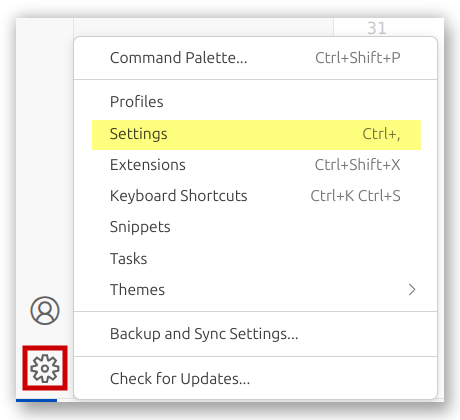
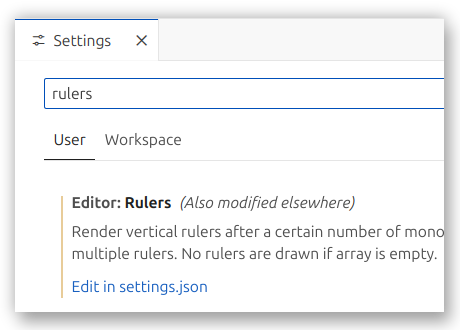
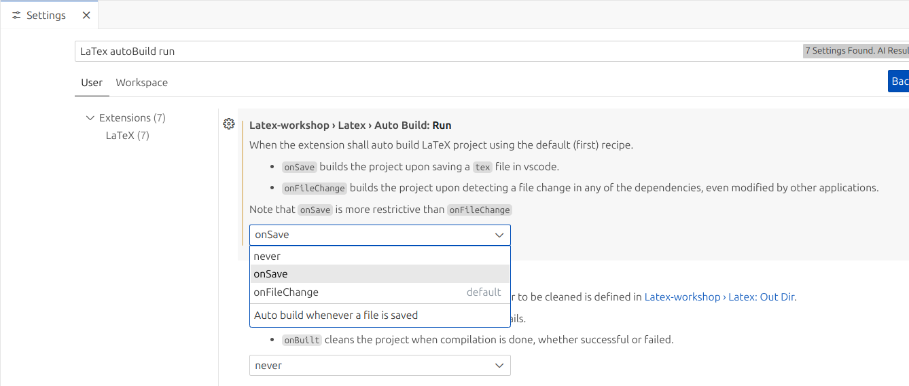
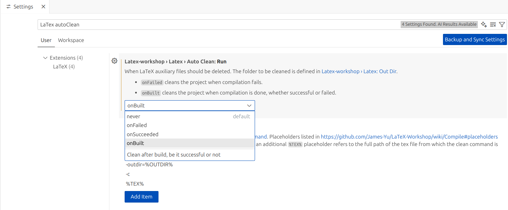
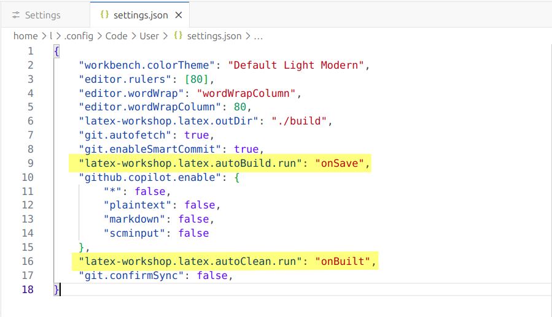
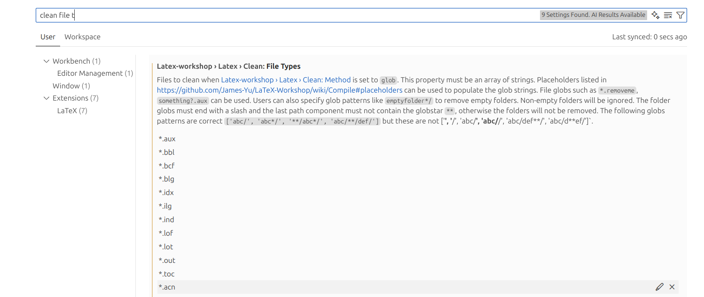
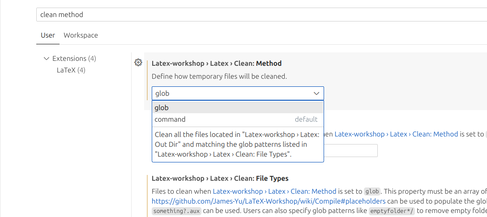

# Configuración y plantilla modular de LaTeX en Visual Studio Code

<!--==Introducción==========================================================================================-->
## Introducción
Este tutorial te eseña como configurar paso a paso **Visual Studio Code** para usar LaTeX junto con una plantilla de **estructura modular** pensada para poder trabajar cómodamente, con:
- configuración automática
- compilación local (offline)
- organización del proyecto por carpetas
- compatibilidad completa con LaTeX Workshop
Ideal para estudiantes, docentes, investigadores o cualquier persona que quiera escribir en LaTeX desde VS Code de forma rápida y ordenada.

<!--==Tabla de contenido====================================================================================-->
## Tabla de contenido
- [Configuración y plantilla modular de LaTeX en Visual Studio Code](#configuración-y-plantilla-modular-de-latex-en-visual-studio-code)
  - [Introducción](#introducción)
  - [Tabla de contenido](#tabla-de-contenido)
  - [Inicio Rápido](#inicio-rápido)
  - [Instalación y configuración de LaTeX en VS Code (Linux)](#instalación-y-configuración-de-latex-en-vs-code-linux)
    - [1. Visual Studio Code instalado](#1-visual-studio-code-instalado)
    - [2. Extensión LaTeX Workshop](#2-extensión-latex-workshop)
    - [3. Paquetes de LaTeX en Linux](#3-paquetes-de-latex-en-linux)
  - [Estructura de la plantilla](#estructura-de-la-plantilla)
  - [Consejos básicos](#consejos-básicos)
    - [Compilar/Guardar](#compilarguardar)
    - [Visualizar PDF](#visualizar-pdf)
    - [Terminal](#terminal)
    - [Snippets y utilidades de LaTeX](#snippets-y-utilidades-de-latex)
    - [Copilot (en caso de su disposición)](#copilot-en-caso-de-su-disposición)
    - [Settings](#settings)
    - [Mejora visual (reglas en 80 columnas)](#mejora-visual-reglas-en-80-columnas)
    - [Consejo extra: Copilot gratuito para estudiantes](#consejo-extra-copilot-gratuito-para-estudiantes)
  - [Consejos avanzados](#consejos-avanzados)
    - [Configuración de salida de compilación](#configuración-de-salida-de-compilación)
    - [](#)
  - [Conectar con Git y GitHub](#conectar-con-git-y-github)
    - [1. Instalación de **Git**](#1-instalación-de-git)
    - [2. Clona el repositorio](#2-clona-el-repositorio)
    - [3. Accede a la carpeta](#3-accede-a-la-carpeta)
    - [4. Utilización de Source Control](#4-utilización-de-source-control)
  - [Organización del proyecto](#organización-del-proyecto)
  - [⚠️Recomendación final:](#️recomendación-final)
  - [Contribución](#contribución)
  - [Recursos adicionales](#recursos-adicionales)

<!--==Inicio Rápido=========================================================================================-->
## Inicio Rápido
Si quieres usar la plantilla de inmediato, sin leer todo el tutorial:
1. **Clona el repositorio**
   ```bash
     git clone https://github.com/L-51/Plantilla-LaTex-para-VSCode.git
   ```
   o con **SSH**:
   ```bash
     git clone git@github.com:L-51/Plantilla-LaTex-para-VSCode.git
   ```
2. Abre la carpeta en **Visual Studio Code**
3. Instala la extensión **LaTeX Workshop** (si no la tienes)
4. Abre `main.tex`
5. Pulsa `Ctrl + S` para compilar
6. Edita las secciones en `template/secciones/`
> Y... ¡Listo! Ya estás trabajando con la plantilla

<!--==Instalación y configuración de LaTeX en VS Code (Linux)===============================================-->
## Instalación y configuración de LaTeX en VS Code (Linux)
Ante de usar la plantilla, asegúrate de tener:
### 1. Visual Studio Code instalado


Sigue las instrucciones oficiales:
[Instalar VSC para Linux](https://code.visualstudio.com/docs/setup/linux)

### 2. Extensión LaTeX Workshop
Instálala desde VS Code:  
`Ctrl + Shift + X` -> busca LaTeX Workshop -> Instalar

### 3. Paquetes de LaTeX en Linux

Ejecuta en la terminal, en VS Code también dispone de un [terminal integrado](#terminal):
```bash
sudo apt install texlive-full -y
```

Esto instala todo lo necesario para compilar localmente.
  
<!--==Estructura de la plantilla============================================================================-->
## Estructura de la plantilla
```bash
📁Plantilla-de-LaTeX-para-VSCode
├── 📄README.md
└── 📁template
    ├── 📁bibliografia
    │   └── 📚ref.bib
    ├── 📁config
    │   ├── ⚙️settings.tex
    │   └── 📄packages.tex
    ├── 📁ficheros
    ├── 📄.gitignore
    ├── 📁images
    │   └── 🖼️Example.png
    ├── 📄main.tex
    ├── 📁portadas
    │   └── 📄portada_ejemplo.tex
    └── 📁secciones
        ├── 📄ejercicio_1.tex
        ├── 📄ejercicio_2.tex
        └── 📄ejercicio_3.tex
```

<!--==Consejos básicos======================================================================================-->
## Consejos básicos  
### Compilar/Guardar
```
Ctrl + S
```
<table>
<tr>
<td align="center">

<br>
<em>Vía botón GUI</em>

</td>
</tr>
</table>

### Visualizar PDF
```
Ctrl + Alt + V
```
<table>
<tr>
<td align="center">

<br>
<em>Vía botón GUI</em>

</td>
</tr>
</table>

Si tienes el **main.pdf** abierto para visualizar, al guardar, se puedes ver los cambios reflejados en el visor

### Terminal
```
Ctrl + `
```
<table>
<tr>
<td align="center">

<br>
<em>Vía botón GUI</em>

</td>
</tr>
</table> 

### Snippets y utilidades de LaTeX
```
Ctrl + Alt + X
```
<table>
<tr>
<td align="center">

<br>
<em>Vía botón GUI</em>

</td>
</tr>
</table> 


### Copilot (en caso de su disposición)
```
Ctrl + I
``` 
<table>
<tr>
<td align="center">

<br>
<em>Botón derecho y seleccionar vía GUI</em>

</td>
</tr>
</table>

### Settings
```
Ctrl + ,
```
<table>
<tr>
<td align="center">

<br>
<em>Ajuste vía GUI</em>

</td>
</tr>
</table>

### Mejora visual (reglas en 80 columnas)


Vamos a [settings](#ajuste-de-vs-code), escribimos en la barra de búsqueda **rulers**:
<table>
<tr>
<td align="center">

<br>
<em>Resultado de la búsqueda</em>

</td>
</tr>
</table>

Pulsamos **Edit in settings.json**, y añadimos lo siguiente para que aparezca a la anchura de 80 caracteres un delimitador cual ajusta la anchura de texto de forma automática:
<pre>
  "editor.rulers": [80],
  "editor.wordWrap": "wordWrapColumn",
  "editor.wordWrapColumn": 80,
</pre>
Por ejemplo, settings.json:
<pre>
{
  "workbench.colorTheme": "Default Light Modern",
  "editor.rulers": [80],
  "editor.wordWrap": "wordWrapColumn",
  "editor.wordWrapColumn": 80,
}
</pre>

### Consejo extra: Copilot gratuito para estudiantes
Al tener cuenta de estudiante, el **Copilot de Github** se puede usar gratuitamente.    

En caso de querer usarlo, instalar **Github Copilot** y **Github Copilot Chat** en el apartado de extensiones como previamente se indicó.  

Para conectar con su cuenta de estudiante, sería ir al apartado de su perfil -> `setting` -> `Emails` y añadir tu cuenta de estudiante

## Consejos avanzados
### Configuración de salida de compilación
Vaya a [settings](#settings) y escriba en la barra de búsqueda `Latex: Out Dir`, y cambie la ruta de salida donde quieras guardar archivos cuales son resultados de la compilación:

<table>
<tr>
<td align="center">

<br>
<em>Se usó <a href="https://github.com/L-51/Plantilla-LaTex-para-VSCode/tree/main/template/build">./build</a> como ejemplo de salida</em>

</td>
</tr>
</table>

### 
  
- **(Opcional 2)** Si accedes a ajuste sea por icono o sea por `Ctrl + ,`, y busca `LaTex Auto Build Run` le aparecerá un apartado donde se podrá elegir la opción de compilación:
  - `never` compila solo cuando lanza el comando **Build LaTeX project** manualmente (`Ctrl+Alt+B` por defecto)
  - `onSave` compila solo cuando **guardas el archivo** (`Ctrl+S`), más recomendable para tener un mejor control de la compilación
  - `onFileChange` compila automáticamente cada vez que **detecta un cambio en el archivo** (aunque no lo guardes)
    
  Y al buscar `LaTex Auto Clean Run`, también dispone de opciones:
  - `onBuilt` limpia después de **cada compilación**
  - `onFailed` limpia solo si la **compilación falla**
  - `onSucceeded` limpia solo si **compilación fue exitosa**
  - `never` limpia solo cuando lanza el comando **LaTeX Workshop: Clean up auxiliary files** (lo puedes buscar con `Ctrl+Shift+P`)
<p>
  
  <p><em>Resultado de la búsqueda</em></p>
</p>
<p>
  
  <p><em>Resultado de la búsqueda</em></p>
</p>
<p>
  
  <p><em>settings.json tras elegir el modo</em></p>
</p>

  Además para poder eliminar todos los archivos de compilación manteniendo solo el `main.pdf`, habría que añadir parámetros en ajuste buscando `Clean: File Types` y en `Clean: Method` elegir la opción **glob** o en su efecto añadiendo al archivo `settings.json` buscando **rulers** como previo en **comodidad visual** del apartado [tips](#tipsconsejos) se indica, y añadir al final de ella:
  <pre>
    "latex-workshop.latex.autoBuild.run": "onSave",
    "latex-workshop.latex.autoClean.run": "onBuilt",
    "latex-workshop.latex.clean.fileTypes": [
        "*.aux",
        "*.bbl",
        "*.bcf",
        "*.blg",
        "*.idx",
        "*.ilg",
        "*.ind",
        "*.lof",
        "*.lot",
        "*.out",
        "*.toc",
        "*.acn",
        "*.acr",
        "*.alg",
        "*.glg",
        "*.glo",
        "*.gls",
        "*.fls",
        "*.log",
        "*.fdb_latexmk",
        "*.snm",
        "*.synctex(busy)",
        "*.synctex.gz(busy)",
        "*.nav",
        "*.vrb",
        "*.run.xml",
        "*.synctex.gz"
    ],
    "latex-workshop.latex.clean.method": "glob",
  </pre>
  <p><em>Con opción de onSave y onBuilt, eliminando todos los archivos de compilación</em></p>
  <p>
    
    <p><em>Resultado de búsqueda y añadir parámetros de forma interactiva</em></p>
  </p>
  <p>
    
    <p><em>Elegir el método de limpieza de forma interactiva</em></p>
  </p>
<!--==Git y GitHub=======================================================================================-->

## Conectar con Git y GitHub
### 1. Instalación de **Git**
```
sudo apt install git -y
```
### 2. Clona el repositorio
```
git clone https://github.com/L-51/Plantilla-LaTex-para-VSCode.git
```
O con **SSH**
```
git clone git@github.com:L-51/Plantilla-LaTex-para-VSCode.git
```
O descarga el zip [template.zip](https://github.com/L-51/Plantilla-LaTex-para-VSCode/releases) en **release** y posteriormente lo descomprime.
### 3. Accede a la carpeta 
Usando _file_ -> **Open Folder** de VSC o _click derecho_ sobre la **carpeta** -> _abrir con_ -> buscar **VS Code** -> _Enter_, o vía terminal con:
<pre>
cd Plantilla-LaTex-para-VSCode
code Plantilla-LaTex-para-VSCode
</pre>


### 4. Utilización de Source Control
Para inicializar un repositorio con **Git** o un **respositorio remoto**, se puede hacer vía terminal como lo indica este [tutorial](https://docs.github.com/en/get-started/git-basics/about-remote-repositories) de GitHub, o, mediante VS Code cual te ofrece una herramienta GUI, **Source Control**, se puede acceder mediante atajo `Ctrl + Shift + G`, o desde el explorador situado a la izquierda.


Donde una vez iniciado el repositorio se podrá realizar **commit** utilizando el **Source Control**.  
Para repositorio remoto, **pull**(recibir cambios del remoto) y **push**(enviar cambios al remoto), a la hora de hacer **commit**, se puede desplegar a la derecha y emplear **Commit & Push** o **Commit & Pull**.  
Aunque aún se puede reliazar todos estos comandos a lo tradicional via terminal, VS Code ofrece una herramienta que facilita esta tarea.

<!--==Organización del proyecto============================================================================-->

## Organización del proyecto
- [**bibliography**](https://github.com/L-51/Plantilla-LaTex-para-VSCode/tree/main/template/bibliography) Aquí guardará las referencias en el fichero [ref.bib](https://github.com/L-51/Plantilla-LaTex-para-VSCode/blob/main/template/bibliografia/ref.bib)
- [**config**](https://github.com/L-51/Plantilla-LaTex-para-VSCode/tree/main/template/config) Aquí están los [packages](https://github.com/L-51/Plantilla-LaTex-para-VSCode/tree/main/template/config/packages.tex) que usarás y [settings](https://github.com/L-51/Plantilla-LaTex-para-VSCode/tree/main/template/config/settings.tex) que se aplica de forma general al proyecto
- [**sections**](https://github.com/L-51/Plantilla-LaTex-para-VSCode/tree/main/template/sections) Esta carpeta contendrá las distintas secciones que forman parte del trabajo
- [**images**](https://github.com/L-51/Plantilla-LaTex-para-VSCode/tree/main/template/images) Carpeta de las imágenes que se usarán para el proyecto
- [**title_pages**](https://github.com/L-51/Plantilla-LaTex-para-VSCode/blob/main/template/title_pages) Esta carpeta contiene las portadas del trabajo en formato LaTeX
- [**main.tex**](https://github.com/L-51/Plantilla-LaTex-para-VSCode/blob/main/template/main.tex) El main donde se incluirá todo, se indica al principio de esta `% !TeX root = main.tex
`
<!--==Recomendación final===================================================================================-->

---  
## ⚠️Recomendación final:
Si tienes poco manejo a la hora de usar GitHub para trabajar con varios usuarios y una mayor comodidad, se recomienda separar de forma explícita los ficheros donde trabajarán cada uno de ellos, y evitar en la medida de lo posible modificar ficheros no correspondido de forma accidental

---
<!--==Contribución==========================================================================================-->
## Contribución
Para contribuir, consulta las [pautas de contribución](./.github/CONTRIBUTING.es.md)

<!--==Recursos adicionales==================================================================================-->
## Recursos adicionales
- [**Documentación** de LaTeX Workshop](https://github.com/James-Yu/LaTeX-Workshop)
- [Manual sencillo para comenzar a escribir en LaTex](https://manualdelatex.com/tutoriales)
- [Plantillas realizadas por LosDelGIIM](https://github.com/LosDelDGIIM/LosDelDGIIM.github.io/tree/main/subjects/_plantillas)
- [Tutorial para realizar un **pull request** en Github](https://github.blog/developer-skills/github/beginners-guide-to-github-creating-a-pull-request/)
- [Badges para readme](https://github.com/inttter/md-badges)
- [Generar y configurar SSH key para tu cuenta de GitHub](https://docs.github.com/en/authentication/connecting-to-github-with-ssh/adding-a-new-ssh-key-to-your-github-account)
- [Cómo realizar tu primera contribución](https://github.com/firstcontributions/first-contributions)
- [Enlaces utiles sobre Git](https://github.com/firstcontributions/first-contributions/blob/main/docs/additional-material/git_workflow_scenarios/Useful-links-for-further-learning.md)